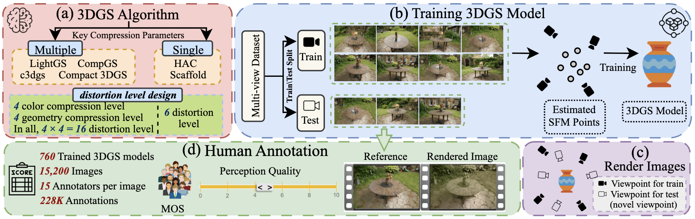

<h1 align="center">3DGS-IEval-15K: A Large-scale Image Quality Evaluation Database for 3D Gaussian-Splatting </h1>

  
  
  

  

---

## 📌 Overview

3DGS-IEval-15K is the first large-scale image quality assessment (IQA) dataset specifically designed for compressed 3DGS representations. It includes:
- 6 representative 3DGS algorithms
- 10 real-world scenes
- 760 Trained 3DGS models
- 20 strategically selected viewpoints
- 15,200 images
- 15 Annotators per image
- 228K Annotations

...