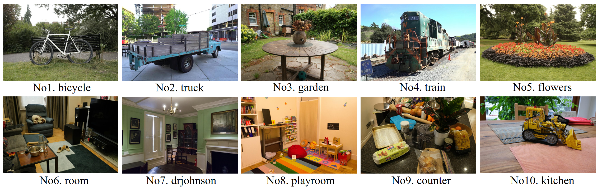
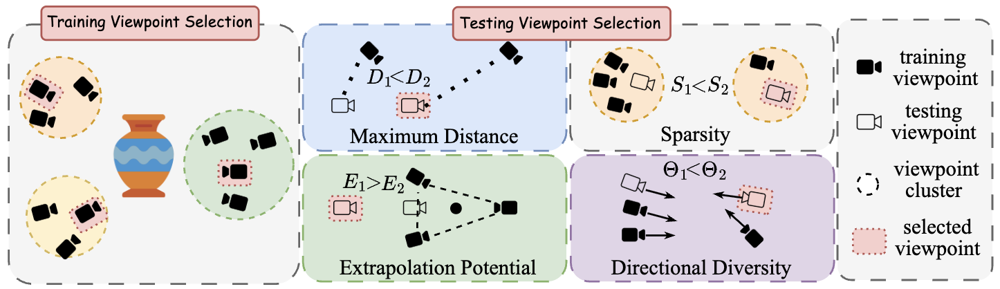

<h1 align="center">3DGS-IEval-15K: A Large-scale Image Quality Evaluation Database for 3D Gaussian-Splatting </h1>

  
  

  

---

## 📌 Overview

3DGS-IEval-15K is the first large-scale image quality assessment (IQA) dataset specifically designed for compressed 3DGS representations. It includes:
- **6** representative 3DGS algorithms
- **10** real-world scenes
- **760** Trained 3DGS models
- **20** strategically selected viewpoints
- **15,200** images
- **15** Annotators per image
- **228K** Annotations

The dataset can be downloaded at the following link: https://huggingface.co/datasets/Chole12/3DGS-IEval-15K
---

## 📌 Source Content

  

**3 Source 3DGS multi-view image dataset:**

- **DeepBlending**：https://github.com/Phog/DeepBlending?tab=readme-ov-file （playroom, drjohnson）

- **Mipnerf360**：https://jonbarron.info/mipnerf360/ （bicycle, flowers, garden, kitchen, room, counter）

- **TanksandTemples**:  https://www.tanksandtemples.org/download/ （train, truck）

---

## 📌 Training and Testing Viewpoints Selection

  

